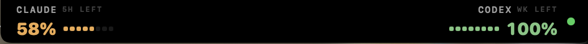
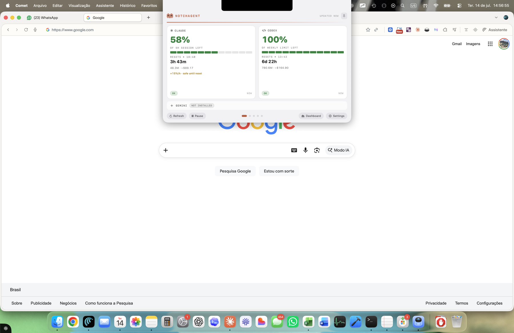
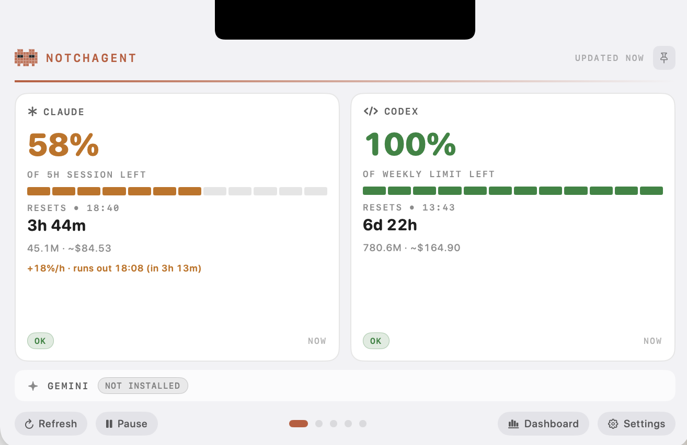
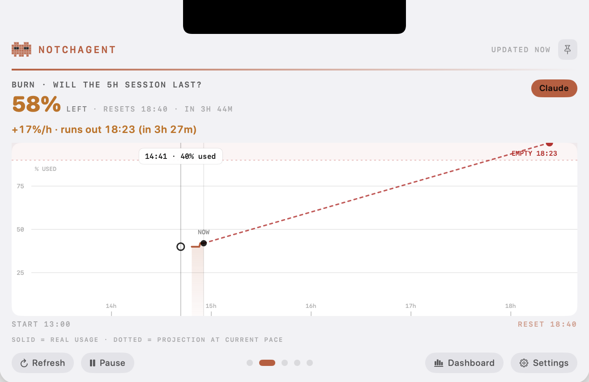
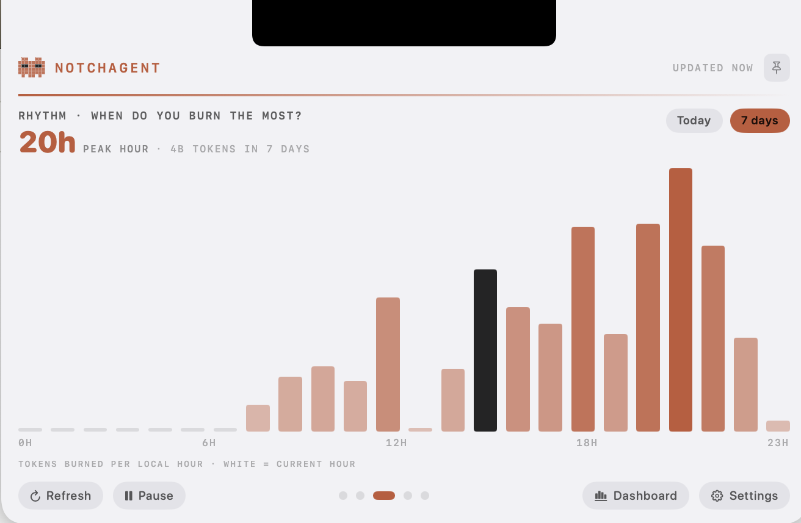
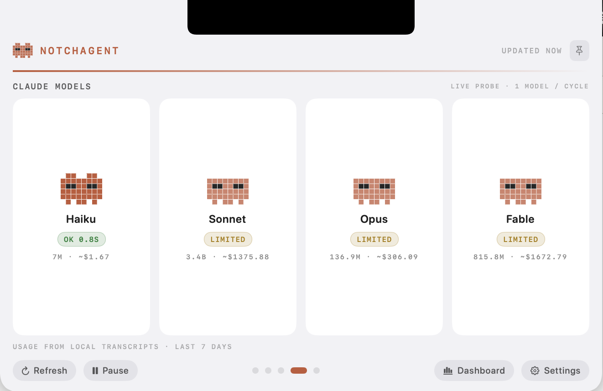
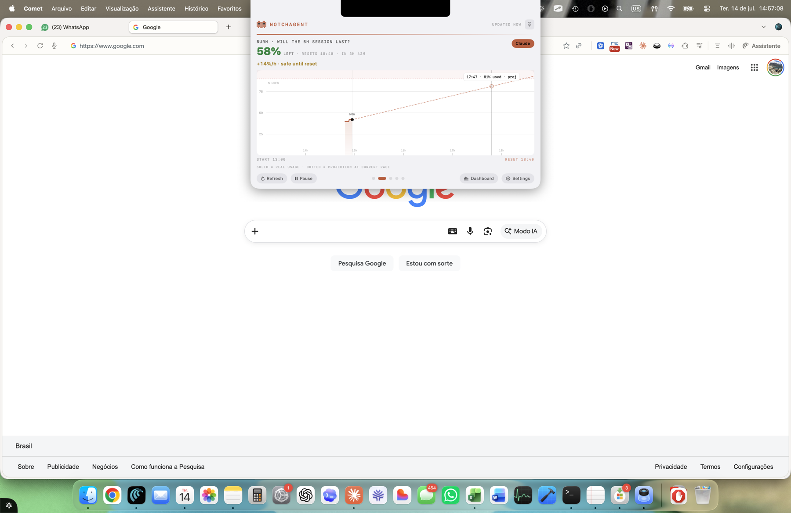
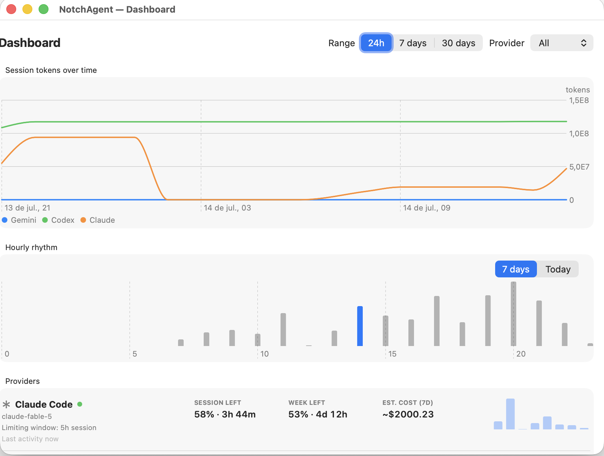
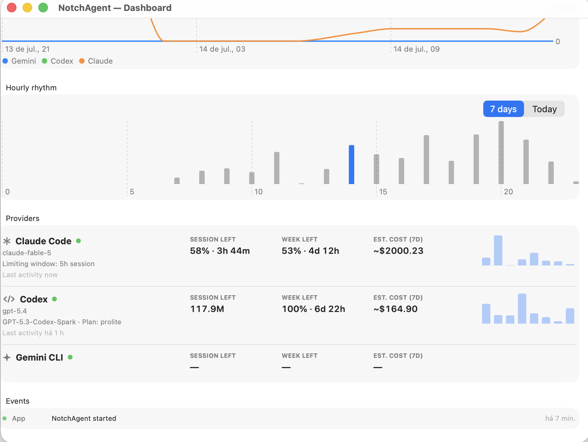
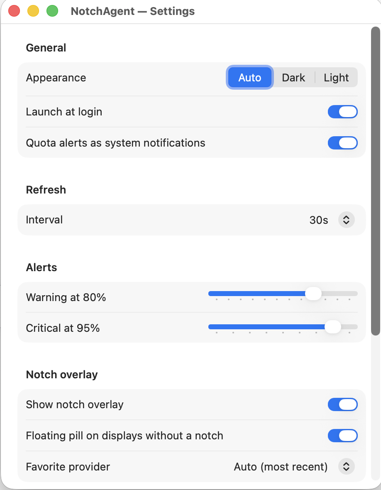

# NotchAgent

**The fuel gauge for your AI agents, living in your MacBook's notch.**

A native macOS menu-bar + notch overlay that answers one question at a glance: **how much of my Claude Code / Codex limit is left?** Official quota percentages (read from Anthropic's rate-limit headers), burn-rate projections ("runs out at 16:40"), per-model usage and cost estimates, escalating low-fuel alerts — all local-first, no backend, no telemetry. Swift 6 + SwiftUI/AppKit, zero Electron.





| NOW — % left per provider | BURN — will the session last? |
|---|---|
|  |  |

| RHYTHM — when do you burn? | MODELS — live probe + cost per model |
|---|---|
|  |  |

<details>
<summary><b>More screenshots</b> — dashboard, burn scrubbing, settings</summary>






</details>

## Install

**Homebrew** (recommended):

```bash
brew install --cask luisroquette/tap/notchagent
xattr -dr com.apple.quarantine /Applications/NotchAgent.app   # free & unsigned — clears Gatekeeper once
open /Applications/NotchAgent.app
```

**Or download** the latest `NotchAgent.app` from [Releases](../../releases), unzip, move to `/Applications`, then clear the quarantine flag:

```bash
xattr -dr com.apple.quarantine /Applications/NotchAgent.app
open /Applications/NotchAgent.app
```

**Or build from source** (Xcode 15+ / Swift 6 toolchain):

```bash
git clone https://github.com/luisroquette/notchagent.git && cd notchagent
./Scripts/make-app.sh && open dist/NotchAgent.app
```

> **Why trust it?** The optional quota probe reads your local Claude Code OAuth token (env var → `~/.claude/.credentials.json` → Keychain, with macOS consent prompt) and sends a single 1-token request to `api.anthropic.com` — nothing else, nowhere else. The token is never logged. That's exactly why this project is open source: read `ClaudeQuotaProbe.swift` yourself.

---

**O medidor de combustível dos seus agentes de IA, morando no notch do MacBook.**

Monitor nativo (Swift 6 + SwiftUI/AppKit, zero Electron) de uso, quotas e custos de Claude Code, Codex e Gemini CLI. Local-first: lê os arquivos de sessão dos CLIs no disco; a única chamada de rede é uma sonda opcional de 1 token à API da Anthropic para ler a quota oficial.

## O produto

**A pergunta que o NotchAgent responde o tempo todo: "quantos % do meu limite ainda tenho?"**

- **Notch compacto** — Claude na asa esquerda, Codex na direita: nome, `% LEFT` da janela (5H ou WK) colorido por estado, micro-medidor que esvazia como tanque de combustível.
- **Painel expandido** (hover expande, clique fixa, **scroll lateral de trackpad troca de página**, Esc fecha) com 4 páginas:
  - **NOW** — cards por provider: `% restante` gigante, medidor segmentado, "RESETS • 16:30" + countdown vivo, tokens/custo estimado, burn verdict, pills de saúde.
  - **BURN** — gráfico da janela 5h: uso real (linha coral) + projeção pontilhada no ritmo atual + veredito "runs out 16:40 (in 1h 32m)".
  - **RHYTHM** — 24 barras por hora local (hoje/7 dias), hora atual em destaque.
  - **MODELS** — Fable, Opus, Sonnet e Haiku com sonda viva (`OK 0.9s` / `Limited` / `Error`, 1 modelo por ciclo) + uso e custo por modelo dos transcripts.
- **Alertas escalonados em 25/15/10/5% livres** — takeover animado do notch que fica mais grave conforme o fim se aproxima (pulso âmbar → alarme vermelho com mascote tremendo aos 5%, que só sai com clique). Notificação do sistema junto. Um disparo por marco por janela, com rearme no reset.
- **Menu bar** — `% restante` no topo + popover com resumo por provider e controles.
- **Dashboard** — histórico (Swift Charts), ritmo por hora, breakdown diário, log de eventos.
- Fallback elegante em displays sem notch (pill flutuante) e mascote pixel-art procedural como assinatura visual.

## Rodar / Empacotar

```bash
swift run                 # desenvolvimento (menu bar + overlay na hora)
swift test                # 52 testes
./Scripts/make-app.sh     # gera dist/NotchAgent.app (ícone incluso, ad-hoc signed)
open dist/NotchAgent.app
```

O bundle habilita: launch at login (SMAppService), notificações do sistema e consentimento persistente do Keychain. `project.yml` (XcodeGen) existe para quem preferir um `.xcodeproj`.

## Dados: o que é real, o que é estimado

| Fonte | Real | Estimado |
|---|---|---|
| **Probe Anthropic** (opcional, ~1 token/min) — headers `anthropic-ratelimit-unified-*` via token OAuth local do Claude Code | % oficial 5h/7d, resets, status `allowed/warning/rejected`, janela limitante, saúde por modelo | — |
| **Transcripts Claude** `~/.claude/projects/**/*.jsonl` | tokens (input/output/cache), modelo por mensagem, blocos 5h, ritmo horário | custo (tabela pública em `PricingTable.swift`) |
| **Rollouts Codex** `~/.codex/sessions/**` | % exato por janela (classificada por `window_minutes` — planos weekly-only como o Spark são detectados), resets, plano, tokens | custo |
| **Gemini CLI** `~/.gemini/tmp/*/logs.json` | prompts/sessões/última atividade | tokens não existem no disco — o app declara, não inventa |

Token OAuth: `CLAUDE_CODE_OAUTH_TOKEN` → `~/.claude/.credentials.json` → Keychain (prompt de consentimento do macOS). Nunca é logado; nunca sai da máquina exceto para `api.anthropic.com`. Desligável em Settings (budgets manuais viram fallback).

## Arquitetura

```
Providers (plugin) ─▶ UsageSnapshot ─▶ UsageStore (@Observable) ─▶ Notch · MenuBar · Dashboard
      ▲ FileScanCache/actors    ▲ StatusAggregator + ThresholdAlerts + BurnRate (puros, testados)
RefreshScheduler ───────────────┴─▶ SnapshotStore/HistoryStore (JSON, 30d)
```

- **Overlay**: `NSPanel` borderless não-ativante (`.statusBar` level, todos os Spaces, sobre fullscreen) com `hitTest` custom — só a forma visível captura cliques; o resto da janela transparente é click-through.
- **Interações**: monitores locais de `scrollWheel` (paging) e `keyDown` (Esc), haptics em página/pin, `TimelineView` para countdowns vivos.
- **Novo provider** = 1 pasta com parser puro + `UsageProvider` + fixture; a UI se adapta às capacidades declaradas.

## Modelo de precisão (o que é exato, o que é estimado)

**Exato (fonte oficial):**
- Os **percentuais** de quota do Claude vêm dos headers `anthropic-ratelimit-unified-*` da API — são **da conta inteira**: cobrem Claude Code CLI, app Desktop, claude.ai web e mobile. O mesmo vale para os percentuais do Codex (rollouts locais refletem o estado da conta).
- Horários de reset e status (`allowed/warning/rejected`) — idem.

**Contado localmente (alinhado à janela oficial):**
- Tokens e custos do Claude somam **todas** as fontes locais de transcript: CLI (`~/.claude/projects`) **e as sessões de agente do app Desktop** (`~/Library/Application Support/Claude/local-agent-mode-sessions`).
- As somas de sessão/semana usam **a mesma janela do percentual** (início = reset oficial − 5h/7d), não "últimas N horas corridas".
- Sessão do Codex soma **todos os rollouts ativos dentro da janela** (sessões concorrentes não subcontam).

**Margens conhecidas (medidas, não estimadas):**
- Conversas de *chat* (Desktop/web) não geram transcript local → contam no **%**, não nos tokens locais.
- Buckets horários ⇒ fronteira de janela com precisão de ±1h nos tokens (o % não é afetado).
- Duplicatas de retry entre arquivos: **0,18%** de inflação medida nesta base (dedup é por arquivo).
- Custos usam tabela de preços pública (`PricingTable.swift`) — planos por assinatura não faturam por token; trate como ordem de grandeza.

## Limitações conhecidas

- Geometria do notch é inferida (`safeAreaInsets` + auxiliary areas) — sem API oficial; fallback pill cobre mudanças da Apple.
- Custos são estimativas por tabela pública; planos por assinatura não faturam por token.
- Assinatura ad-hoc: o consentimento do Keychain re-pergunta a cada rebuild (muda a assinatura). Resolve com Developer ID.
- `Limited` na página MODELS reflete o rate-limit unificado da conta no momento da sonda, não indisponibilidade do modelo em si.

## Checklist de comercialização

- [x] Feature-complete v1.0 · 52 testes · smoke em máquina real
- [x] .app empacotado com ícone + launch-at-login + notificações
- [ ] Conta Apple Developer → assinar com Developer ID + `notarytool` + staple *(requer credenciais do dono)*
- [ ] DMG (`create-dmg`) e/ou cask Homebrew apontando para GitHub Releases
- [ ] Auto-update (Sparkle) — pós-lançamento
- [ ] Site/landing + licenciamento (Paddle/Lemon Squeezy) — decisão de negócio

## Observabilidade

```bash
/usr/bin/log stream --predicate 'subsystem == "br.com.lfrprojects.notchagent"' --level debug
```
